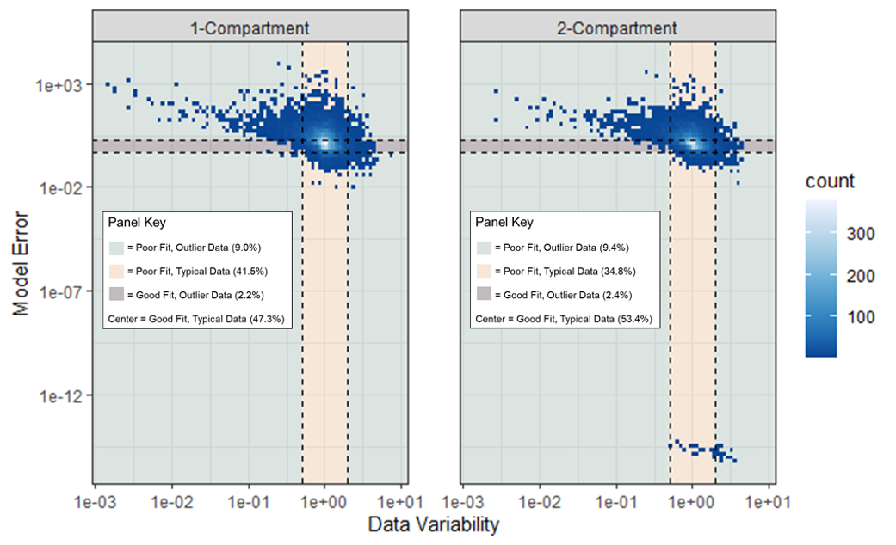

```{r setup, include = FALSE}
knitr::opts_chunk$set(echo = FALSE)
knitr::opts_chunk$set(warning = FALSE)
knitr::opts_chunk$set(message = FALSE)
```

```{r, include = FALSE}
library(tidyverse)
library(data.table)
devtools::load_all(".")
```

```{r, load_data, include=FALSE}

### load all of this wonderful data
load("figures_rdata/pk_output_1comp_12212021.Rdata")
load("figures_rdata/pk_output_2comp_12212021.Rdata")
load("figures_rdata/raw_1comp_12212021.Rdata")
load("figures_rdata/raw_2comp_12212021.Rdata")
load("figures_rdata/cp_df_12212021.Rdata")
load("figures_rdata/cvt_variability_df_12212021.Rdata")
load("figures_rdata/pk_lombardo_02072022.Rdata")
```

# 1 Expansion of the Concentration *versus* Time Database

## **1a) What is the CvTdb?**

* The Concentration *versus* Time Database  (CvTdb) is a database of standardized CvT data (time-course data of chemical compound concentrations measured *in vivo*) from hundreds of diverse publications, and serves as a platform for assessing PK/TK models on a large set of data. (Sayre, Grulke, and Wambaugh, 2020).

```{r, exp_plot, out.width="65%", fig.align="center", fig.cap="Typical plot from which CvT data is extracted. From Sowa and Steibert (1985)."}
knitr::include_graphics("poster/tk_curve.png")
```

* The CvTdb contains 181 unique analytes, including 54 pharmaceuticals (~30%). 96 analytes are present in EPA's ToxCast dataset (~53%).

## **1b) Integration of Data Shared by Other Institutions**

* Showa Pharmaceutical University shared CvT data consisting of over 200 unique compounds (Kamiya *et al.*, 2020; Kamiya *et al.*, 2021).

* If YOU have CvT data, please consider collaborating with us! Visit [https://github.com/USEPA/CompTox-PK-CvTdb](https://github.com/USEPA/CompTox-PK-CvTdb) or email Wambaugh.John@epa.gov

# 2 Toxicokinetic Trends Across Chemicals

* We can explore trends across chemicals and references using the CvTdb. 

* "In PBPK modeling, predictions that are, on average, within a **factor of 2** of the experimental
data have frequently been considered adequate" (WHO, 2010).


* In Figure 2, 84.9% of replicate timepoint data in the CvTdb is within a factor of two of their respective mean. The "factor of two" rule may not be appropriate if the data is spread beyond a factor of two.

```{r, make_cvt_variability_histogram, out.width = "75%", fig.align = "center", fig.cap = "The CvTdb data was grouped into unique combinations of compound/reference/route/dose/timepoint. Groups without replicate timepoints were removed. If all replicate timepoints corresponded to non-detect concentration values, those data were removed. If some, but not all replicate timepoints corresponded to non-detect concentration values, those values were set to equal 0.45 of the minimum value. Each concentration was normalized by the mean concentration of each group."}

#################
#################

data <- cvt_variability_df_12212021

#################
#################

p <- ggplot(data, aes(x = conc_norm)) +
  geom_histogram() +
  xlim(c(0, 4)) +
  geom_vline(xintercept = c(0.5, 2),
             color = "Red",
             linetype = "dashed") +
  theme_bw() +
  labs(x = "Normalized concentration",
       y = "Number of observations")
p
```

# 3 Introducing *invivoPKfit* 

## **3a) What is *invivoPKfit*?**

* R package that fits 1- and 2- compartment models to CvT data and extrapolates TK parameter values (e.g., half-life, elimination rate, and volume of distribution)

```{r, workflow, out.width="30%", fig.align="center", fig.cap="Typical plot from which CvT data is extracted. From Sowa and Steibert (1985)."}
knitr::include_graphics("poster/pk_workflow.png")
```

## **3b) TK Model Descriptions**
|    **<span style="text-decoration:underline">1-Compartment Model</span>**  

```{r, 1_comp, fig.cap = "1-Compartment Model. Adapted from Wambaugh et al. (2018).", fig.align = "center",  out.width = "75%"}
knitr::include_graphics("poster/1_comp.png")
```

$$
C_{iv}(dose,\ t)\ =\ \frac{dose}{V_d} e ^ {(-k_{elim}\ *\ t)}
$$  

$$
C_{oral}(dose,\ t)\ =\ \frac{F_{bio}\ *\ dose}{V_{d}}\ *\ \frac{k_{abs}\ *\ (e ^ {-k_{elim}\ *\ t}\ -\ e ^ {-k_{abs}\ *\ t})}{k_{abs}\ -\ k_{elim}}   
$$  

* Parameters include $V_d$ (volume of distribution), $k_{elim}$ (elimination rate), $k_{abs}$ (absorption rate; oral only), and $F_{bio}$ (fraction bioavailable; oral only).  

|    **<span style="text-decoration:underline">2-Compartment Model</span>**

```{r, 2_comp, fig.cap = "2-Compartment Model. Adapted from Wambaugh et al. (2018).", fig.align = "center", out.width = "75%"}
knitr::include_graphics("poster/2_comp.png")
```

$$
C_{iv}(dose,\ t)\ =\ A\ *\ e^{-\alpha\ *\ t}\ +\ B\ *\ e^{-\beta\ *\ t}
$$  
$$
C_{oral}(dose,\ t)\ =\ A\ *\ e^{-\alpha\ *\ t}\ +\ B\ *\ e^{-\beta\ *\ t}\ +\ C\ *\ e^{-ka\ *\ t}
$$
* Parameters include $V1$ (volume of primary compartment), $k_{elim}$, $k_{12}$ (distribution rate to deep compartment), $k_{21}$ distribution rate from deep compartment), $k_{abs}$ (oral only), $F_{bio}$ (oral only).

## **3c) Statistical Model Description**

* *invivoPKfit* calculates the probability of $C_{obs}$ given a PK model $M(p,\ t)$ and a statistical model $S(\sigma)$, where $P\ =\ L(C_{obs},\ M,\ S)$, and assumes that $C_{obs}$ are log-normally distributed around the concentrations predicted by $M(p,\ t)$ (Cox and Hinkley, 1979).

$$
ln\ L(x,\ \mu,\ \sigma)\ =\ \Sigma_{i=1,n}ln\frac{1}{x\sigma \sqrt{2\pi}}e^{-\frac{1}{2}\left( \frac{ln\ x\ -\ \mu)}{\sigma} \right)^2}
$$

$$
ln\ L(x,\ \mu,\ \sigma)\ =\ \Sigma_{i=1,n}ln\frac{1}{C_{obs,i}\sigma \sqrt{2\pi}}e^{-\frac{1}{2}\left( \frac{ln\ C_{obs,i}\ -\ M(p,t_i)}{\sigma} \right)^2}
$$

```{r, log, warning = FALSE, fig.align = "center", out.width = "60%", fig.cap = "Log-Normal Distribution"}
load(file = "poster/lognormal.Rdata")
p9
```

* The R package, [*optimx*](https://cran.r-project.org/web/packages/optimx/index.html) (Nash and Varadhan, 2011; Nash, 2014) optimizes the log-likelihood equation and estimates $p$ and $\sigma$

* We used the Hessian of the likelihood function to estimate standard deviations of the log parameter (Dovi, 1991)

|    **<span style="text-decoration:underline">Interstudy Variability</span>**

```{r, interstudy, fig.align = "center", out.width = "100%", fig.cap = "Log-Normal Distribution"}

```

# 4 ** *invivoPKfit* Analyses**

## **4a) Predicted Concentrations**

* 58.4% of 12134 concentrations predicted by the 1-compartment model fit within a factor of two of the observed concentrations.

* 64.8% of 9684 concentrations predicted by the 2-compartment model fit within a factor of two of the observed concentrations.

```{r, make_cp_histogram, fig.align = "center", out.width = "75%", fig.cap = "Concentrations were predicted by applying estimated model parameters to the timepoints present in the data. Predicted concentrations were normalized by observed concentrations. This plot does not include 'Joint Analysis' models. The red dashed lines mark the 'factor of two' bounds."}

##################
##################

data <- cp_df_12212021

##################
##################

p <- ggplot(data = data,
            mapping = aes(x = cp_norm)) +
  geom_histogram(bins = 30) +
  geom_vline(xintercept = c(0.5, 2),
             color = "Red",
             linetype = "dashed") +
  # xlim(0, 1e42) +
  # ylim(0, 400) +
  # scale_y_log10()+
  theme(title = element_text(size = 16),
        axis.text = element_text(size = 12),
        axis.title = element_text(size = 14)) +
  scale_x_log10(limits = c(0.01, 1000)) +
  theme_bw() +
  labs(x = "Predicted/Observed",
       y = "Number of Observations") +
  facet_wrap(. ~ type)

p
```

## **4b) *invivoPKfit* Performance *versus* Data Variability**

* Can start to gauge how data variability influences the performance of a model

```{r, fig.cap = "2-Compartment Model. Adapted from Wambaugh et al. (2018).", fig.align = "center", out.width = "100%"}

```

## **4c Diagnosing Poor Fits**

# What's Next?

# References

# Acknowledgements/Disclaimers
