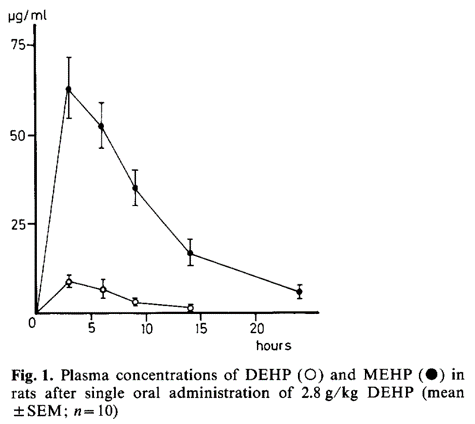
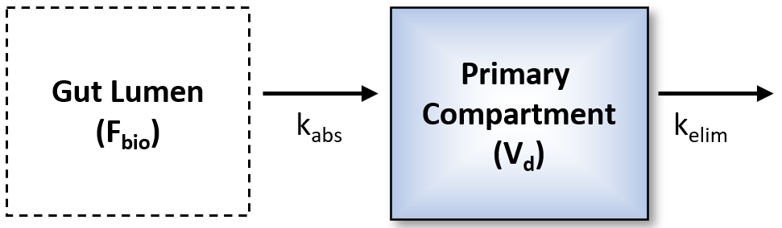
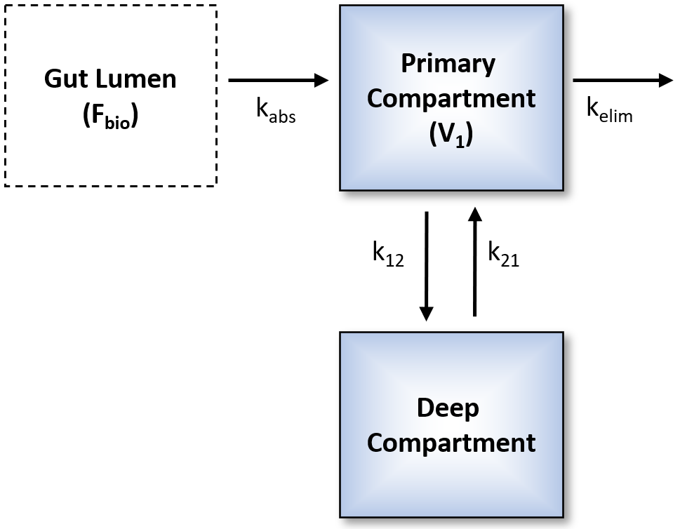
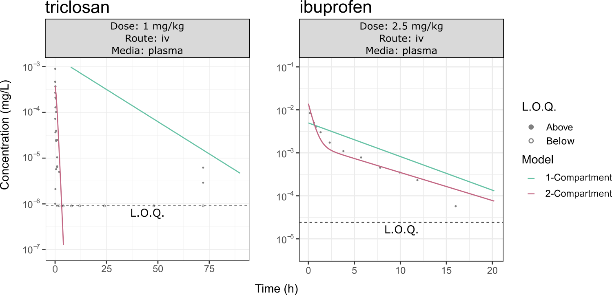

<style>
body {
text-align: left}
</style>

```{r setup, include = FALSE}
knitr::opts_chunk$set(echo = FALSE)
knitr::opts_chunk$set(warning = FALSE)
knitr::opts_chunk$set(message = FALSE)
```

```{r, include = FALSE}
library(tidyverse)
library(data.table)
devtools::load_all(".")
```

```{r, load_data, include=FALSE}

### load all of this wonderful data
load("figures_rdata/pk_output_1comp_03012022.Rdata")
load("figures_rdata/pk_output_2comp_03012022.Rdata")
load("figures_rdata/pk_output_flat_03012022.Rdata")
load("figures_rdata/raw_1comp_03012022.Rdata")
load("figures_rdata/raw_2comp_03012022.Rdata")
load("figures_rdata/raw_flat_03012022.Rdata")
load("figures_rdata/cp_df_03012022.Rdata")
load("figures_rdata/cvt_variability_df_03012022.Rdata")
```

# 1 Expansion of the Concentration *versus* Time Database

## **1a) What is the CvTdb?**

* The Concentration *versus* Time Database  (CvTdb) is a database of standardized time-course data of chemical compound concentrations measured *in vivo* from hundreds of diverse publications. It serves as a platform for assessing PK/TK models on a large set of data. (Sayre, Grulke, and Wambaugh, 2020).

```{r, tk-curve, out.width="60%", fig.align="center", fig.cap="Typical plot from which CvT data is extracted. From Sowa and Steibert (1985)."}

```

* The CvTdb contains 389 unique chemicals, including 70 pharmaceuticals (~30%). 101 analytes are present in EPA's ToxCast dataset (~53%).

## **1b) Integration of Data Shared by Other Institutions**

* Showa Pharmaceutical University shared CvT data consisting of over 200 unique compounds (Kamiya *et al.*, 2020; Kamiya *et al.*, 2021).

* If YOU have CvT data, please consider collaborating with us! Visit [https://github.com/USEPA/CompTox-PK-CvTdb](https://github.com/USEPA/CompTox-PK-CvTdb) or email Wambaugh.John@epa.gov

# 2 Toxicokinetic Trends Across Chemicals

* We can explore trends across chemicals and references using the CvTdb. 

* "In PBPK modeling, predictions that are, on average, within a **factor of 2** of the experimental
data have frequently been considered adequate" (WHO, 2010).


* In Figure 2, 85.1% of replicate timepoint data in the CvTdb is within a factor of two of their respective mean. The "factor of two" rule may not be appropriate if the data itself is spread beyond a factor of two.

```{r, make-cvt-variability-histogram, out.width = "65%", fig.align="center", fig.cap = "The CvTdb data was grouped into unique combinations of compound/reference/route/dose/timepoint. Groups without replicate timepoints were removed. If all replicate timepoints corresponded to non-detect concentration values, those data were removed. If some, but not all replicate timepoints corresponded to non-detect concentration values, those values were set to equal 0.45 of the minimum value. Each concentration was normalized by the mean concentration of each group."}

#################
#################

data <- cvt_variability_df_03012022

#################
#################

p <- ggplot(data, aes(x = conc_norm)) +
  geom_histogram(binwidth = 0.25) +
  xlim(c(0, 4)) +
  geom_vline(xintercept = c(0.5, 2),
             color = "Red",
             linetype = "dashed") +
  theme_bw() +
  labs(x = "Normalized concentration",
       y = "Number of observations")
p
```

# 3 Introducing *invivoPKfit* 

## **3a) What is *invivoPKfit*?**

* R package that fits 1- and 2- compartment models to CvT data and extrapolates TK parameter values (e.g., half-life, elimination rate, and volume of distribution)

```{r, workflow, out.width="35%", fig.align="center", fig.cap="_invivoPKfit_ workflow."}
knitr::include_graphics("poster/pk_workflow.png")
```

## **3b) TK Model Descriptions**
|    **<span style="text-decoration:underline">1-Compartment Model</span>**  

```{r, one-comp, fig.align="center", out.width = "69%", fig.cap="1-Compartment Model. Adapted from Wambaugh et al. (2018)."}

```

$$
C_{iv}(dose,\ t)\ =\ \frac{dose}{V_d} e ^ {(-k_{elim}\ *\ t)}
$$  

$$
C_{oral}(dose,\ t)\ =\ \frac{F_{bio}\ *\ dose}{V_{d}}\ *\ \frac{k_{abs}\ *\ (e ^ {-k_{elim}\ *\ t}\ -\ e ^ {-k_{abs}\ *\ t})}{k_{abs}\ -\ k_{elim}}   
$$  

* Parameters include $V_d$ (volume of distribution), $k_{elim}$ (elimination rate), $k_{abs}$ (absorption rate; oral only), and $F_{bio}$ (fraction bioavailable; oral only).  

|    **<span style="text-decoration:underline">2-Compartment Model</span>**

```{r, two-comp, fig.cap = "2-Compartment Model. Adapted from Wambaugh et al. (2018).", fig.align = "center", out.width = "69%"}

```

$$
C_{iv}(dose,\ t)\ =\ A\ *\ e^{-\alpha\ *\ t}\ +\ B\ *\ e^{-\beta\ *\ t}
$$
$$
C_{oral}(dose,\ t)\ =\ A\ *\ e^{-\alpha\ *\ t}\ +\ B\ *\ e^{-\beta\ *\ t}\ +\ C\ *\ e^{-ka\ *\ t}
$$

* Parameters include $V1$ (volume of primary compartment), $k_{elim}$, $k_{12}$ (distribution rate to deep compartment), $k_{21}$ distribution rate from deep compartment), $k_{abs}$ (oral only), $F_{bio}$ (oral only).

## **3c) Statistical Model Description**

* *invivoPKfit* calculates the probability of $C_{obs}$ given a PK model $M(p,\ t)$ and a statistical model $S(\sigma)$, where $P\ =\ L(C_{obs},\ M,\ S)$, and assumes that $C_{obs}$ are log-normally distributed around the concentrations predicted by $M(p,\ t)$ (Cox and Hinkley, 1979).

$$
ln\ L(x,\ \mu,\ \sigma)\ =\ \Sigma_{i=1,n}ln\frac{1}{x\sigma \sqrt{2\pi}}e^{-\frac{1}{2}\left( \frac{ln\ x\ -\ \mu)}{\sigma} \right)^2}
$$

$$
ln\ L(x,\ \mu,\ \sigma)\ =\ \Sigma_{i=1,n}ln\frac{1}{C_{obs,i}\sigma \sqrt{2\pi}}e^{-\frac{1}{2}\left( \frac{ln\ C_{obs,i}\ -\ M(p,t_i)}{\sigma} \right)^2}
$$

```{r, lognormal, warning = FALSE, fig.align = "center", out.width = "70%", fig.cap = "Log-Normal Distribution"}
load(file = "poster/lognormal.Rdata")
p9
```

* The R package, [*optimx*](https://cran.r-project.org/web/packages/optimx/index.html) (Nash and Varadhan, 2011; Nash, 2014) optimizes the log-likelihood equation and estimates $p$ and $\sigma$.

* We used the Hessian of the likelihood function to estimate standard deviations of the log parameter (Dovi, 1991).

# 4 *invivoPKfit* Analyses

## **4a) Predicted Concentrations**

* 63.3% of 16,675 concentrations predicted by the 1-compartment model fit within a factor of two of the observed concentrations.

* 69.1% of 13,097 concentrations predicted by the 2-compartment model fit within a factor of two of the observed concentrations.

```{r, make-cp-histogram, out.width="65%", fig.align="center", fig.cap = "Concentrations were predicted using the estimated model parameters. Predicted concentrations were normalized by observed concentrations, such that C~pred~ / C~obs~ . The red dashed lines mark the ‘factor of two’ bounds. This plot does not include ‘Joint Analysis’ fits."}

##################
##################

data <- cp_df_03012022

##################
##################

p <- ggplot(data = data,
            mapping = aes(x = cp_norm)) +
  geom_histogram(bins = 32) +
  geom_vline(xintercept = c(0.5, 2),
             color = "Red",
             linetype = "dashed") +
  theme(title = element_text(size = 16),
        axis.text = element_text(size = 12),
        axis.title = element_text(size = 14)) +
  scale_x_log10(limits = c(0.01, 1000)) +
  theme_bw() +
  labs(x = "Predicted/Observed",
       y = "Number of Observations") +
  facet_wrap(. ~ type)

p
```

## **4b) *invivoPKfit* Performance *versus* Data Variability**

* Can start to gauge how data variability influences the performance of a model

```{r, print-density-plot, out.width="100%", fig.align = "center", fig.cap="Predicted concentrations were normalized by observed concentrations (see Figure 7), and plotted against observed concentrations normalized by experiment-timpoint specific replicates (see Figure 2). The dashed lines mark the 'factor of 2' bounds for each axis. Sections were assigned based on both the ability of a model to accurately predict an observed concentration and the spread of the observed data. Points colored pink represent concentrations significantly underpredicted by the model."}

knitr::include_graphics("poster/density_plot_v4.png")
```

```{r, make-density-plot, out.width = "70%", fig.align = "center", fig.cap="Predicted concentrations were normalized by observed concentrations (see Figure 7), and plotted against observed concentrations normalized by experiment-timpoint specific replicates (see Figure 2). The dashed lines mark the 'factor of 2' bounds for each axis. Sections were assigned based on both the ability of a model to accurately predict an observed concentration and the spread of the observed data.", eval = FALSE}

##################
##################

pk_data <- cp_df_03012022

cvt_data <- cvt_variability_df_03012022

##################
##################

row.names(pk_data) <- c()

cvt_data <- dplyr::select(cvt_data, -c("kelim", 
                                       "Vdist", 
                                       "Fgutabs", 
                                       "kgutabs"))

### split pk_data by model so you can properly join with raw data
model_split <- split(pk_data, pk_data$model)

cvt_data$Reference <- as.character(cvt_data$Reference)

cvt_data$type <- "1-Compartment"
full_data_1 <- left_join(cvt_data, model_split$`1compartment`)

cvt_data$type <- "2-Compartment"
full_data_2 <- left_join(cvt_data, model_split$`2compartment`)

### put data back together
full_data <- rbind(full_data_1, full_data_2)

full_data <- full_data %>%
  filter(cp != 0) %>%
  filter(Compound != "triclosan")
  # filter(Compound != "tamoxifen")

###########
###########
###########

### Find number of points in each plot panel for 1-compartment
full_data_1_center <- full_data_1 %>% filter(conc_norm >= 0.5 & conc_norm <= 2)
full_data_1_center <- full_data_1_center %>% filter(cp_norm >= 0.5 & cp_norm <= 2)
ratio_1_center <- nrow(full_data_1_center) / nrow(full_data_1 %>% filter(!is.na(cp_norm)))

full_data_1_green <- full_data_1 %>% filter(conc_norm < 0.5 | conc_norm > 2)
full_data_1_green <- full_data_1_green %>% filter(cp_norm < 0.5 | cp_norm > 2)
ratio_1_green <- nrow(full_data_1_green) / nrow(full_data_1 %>% filter(!is.na(cp_norm)))

full_data_1_gray <- full_data_1 %>% filter(conc_norm < 0.5 | conc_norm > 2)
full_data_1_gray <- full_data_1_gray %>% filter(cp_norm >= 0.5 & cp_norm <= 2)
ratio_1_gray <- nrow(full_data_1_gray) / nrow(full_data_1 %>% filter(!is.na(cp_norm)))

full_data_1_tan <- full_data_1 %>% filter(conc_norm >= 0.5 & conc_norm <= 2)
full_data_1_tan <- full_data_1_tan %>% filter(cp_norm < 0.5 | cp_norm > 2)
ratio_1_tan <- nrow(full_data_1_tan) / nrow(full_data_1 %>% filter(!is.na(cp_norm)))

###########
###########

### Find number of points in each plot panel for 2-compartment
full_data_2_center <- full_data_2 %>% filter(conc_norm >= 0.5 & conc_norm <= 2)
full_data_2_center <- full_data_2_center %>% filter(cp_norm >= 0.5 & cp_norm <= 2)
ratio_2_center <- nrow(full_data_2_center) / nrow(full_data_2 %>% filter(!is.na(cp_norm)))

full_data_2_green <- full_data_2 %>% filter(conc_norm < 0.5 | conc_norm > 2)
full_data_2_green <- full_data_2_green %>% filter(cp_norm < 0.5 | cp_norm > 2)
ratio_2_green <- nrow(full_data_2_green) / nrow(full_data_2 %>% filter(!is.na(cp_norm)))

full_data_2_gray <- full_data_2 %>% filter(conc_norm < 0.5 | conc_norm > 2)
full_data_2_gray <- full_data_2_gray %>% filter(cp_norm >= 0.5 & cp_norm <= 2)
ratio_2_gray <- nrow(full_data_2_gray) / nrow(full_data_2 %>% filter(!is.na(cp_norm)))

full_data_2_tan <- full_data_2 %>% filter(conc_norm >= 0.5 & conc_norm <= 2)
full_data_2_tan <- full_data_2_tan %>% filter(cp_norm < 0.5 | cp_norm > 2)
ratio_2_tan <- nrow(full_data_2_tan) / nrow(full_data_2 %>% filter(!is.na(cp_norm)))

outlier_df <- full_data %>%
  

p <- ggplot() +
  annotate(geom = "rect", xmin = 0, xmax = 0.5, ymin = 2, ymax = Inf, alpha = 0.3, fill = "#86A397") +
  annotate(geom = "rect", xmin = 0, xmax = 0.5, ymin = 0, ymax = 0.5, alpha = 0.3, fill = "#86A397") +
  annotate(geom = "rect", xmin = 2, xmax = Inf, ymin = 0, ymax = 0.5, alpha = 0.3, fill = "#86A397") +
  annotate(geom = "rect", xmin = 2, xmax = Inf, ymin = 2, ymax = Inf, alpha = 0.3, fill = "#86A397") +
  annotate(geom = "rect", xmin = 0, xmax = 0.5, ymin = 0.5, ymax = 2, alpha = 0.3, fill = "#361D2E") +
  annotate(geom = "rect", xmin = 2, xmax = Inf, ymin = 0.5, ymax = 2, alpha = 0.3, fill = "#361D2E") +
  annotate(geom = "rect", xmin = 0.5, xmax = 2, ymin = 2, ymax = Inf, alpha = 0.3, fill = "#E1B07E") +
  annotate(geom = "rect", xmin = 0.5, xmax = 2, ymin = 0, ymax = 0.5, alpha = 0.3, fill = "#E1B07E") +
  annotate(geom = "rect", xmin = 0.5, xmax = 2, ymin = 0.5, ymax = 2.0, alpha = 0.5, fill = "black") +
  theme_bw() +
  theme(panel.spacing = unit(2, "lines")) +
  geom_bin2d(data = full_data,
            mapping = aes(x = conc_norm, y = cp_norm),
            bins = 100) +
  scale_fill_distiller(palette = "Blues") +
  geom_vline(xintercept = c(0.5, 2),
             linetype = "dashed") +
  geom_hline(yintercept = c(0.5, 2),
             linetype = "dashed") +
  scale_x_log10() +
  scale_y_log10() +
  labs(x = "Data Variability",
       y = "Model Performance") +
  facet_wrap(. ~ type) 

p
```

## **4c) Diagnosing Poor Fits**

* Plotting model predictions against observed data can help determine why a model might fit poorly. A poor fit could indicate 1) a deficiency in the model, 2) an inaccurate curation of data, and/or 3) a deficiency in the experimental collection of data.

```{r, out.width="100%", fig.align="center", fig.cap="1-compartment model (green line) and 2-compartment model (red line) fit through CvT data (gray points) Open points represent non-detects that were below the limit of quantitation (L.O.Q.)."}

```

<!-- # Conclusions and New Goals -->

<!-- * The CvTdb is useful for the calibration and validation of TK models, as evidenced by our *invivoPKfit* analyses -->

<!-- * The CvTdb can help answer questions regarding the goodness of fit of a model. Preliminary analyses suggest that the **factor of two** criterion may be too strict -->

<!-- * To further gauge the performance of *invivoPKfit*, we need to compare our model parameter estimates with those estimated through more chemical-specific models. -->


# References

<font size = "5"> <div id="refs"></div> </font>

<!-- <bibliography entry-spacing = "0.5" > <font size = "5"> <div id="refs"></div> </font> <bibliography entry-spacing = "0.5" > -->
<!-- <font size = "5">  -->
<!-- Boxenbaum, Harold G., Sidney Riegelman, and Robert M. Elashoff. 1974. “Statistical Estimations in Pharmacokinetics.” Journal of Pharmacokinetics and Biopharmaceutics 2 (2): 123–48. https://doi.org/10.1007/BF01061504. -->
<!-- Cox, D. R., and D. V. Hinkley. 1979. Theoretical Statistics. CRC Press. -->
<!-- Dovi, V. G., O. Paladino, and A. P. Reverberi. 1991. “Some Remarks on the Use of the Inverse Hessian Matrix of the Likelihood Function in the Estimation of Statistical Properties of Parameters.” Applied Mathematics Letters 4 (1): 87–90. https://doi.org/https://doi.org/10.1016/0893-9659(91)90129-J. -->
<!-- Kamiya, Yusuke, Kentaro Handa, Tomonori Miura, Junya Ohori, Makiko Shimizu, Masato Kitajima, Fumiaki Shono, Kimito Funatsu, and Hiroshi Yamazaki. 2021. “An Updated in Silico Prediction Method for Volumes of Systemic Circulation of 323 Disparate Chemicals for Use in Physiologically Based Pharmacokinetic Models to Estimate Plasma and Tissue Concentrations After Oral Doses in Rats.” Chemical Research in Toxicology 34 (10): 2180–3. https://doi.org/10.1021/acs.chemrestox.1c00249. -->
<!-- Kamiya, Yusuke, Shohei Otsuka, Tomonori Miura, Manae Yoshizawa, Ayane Nakano, Miyu Iwasaki, Yui Kobayashi, et al. 2020. “Physiologically Based Pharmacokinetic Models Predicting Renal and Hepatic Concentrations of Industrial Chemicals After Virtual Oral Doses in Rats.” Chemical Research in Toxicology 33 (7): 1736–51. https://doi.org/10.1021/acs.chemrestox.0c00009. -->
<!-- Kudo, Naomi, Masanori Katakura, Yasunori Sato, and Yoichi Kawashima. 2002. “Sex Hormone-Regulated Renal Transport of Perfluorooctanoic Acid.” Chemico-Biological Interactions 139 (3): 301–16. https://doi.org/10.1016/s0009-2797(02)00006-6. -->
<!-- Nash, John C. 2014. “On Best Practice Optimization Methods in R.” Journal of Statistical Software 60 (2): 1–14. https://doi.org/10.18637/jss.v060.i02. -->
<!-- Nash, John C., and Ravi Varadhan. 2011. “Unifying Optimization Algorithms to Aid Software System Users: optimx for R.” Journal of Statistical Software 43 (9): 1–14. https://doi.org/10.18637/jss.v043.i09. -->
<!-- O’Flaherty, E. J. 1981. Toxicants and Drugs: Kinetics and Dynamics. John Wiley & Sons. -->
<!-- Sayre, Risa R., John F. Wambaugh, and Christopher M. Grulke. 2020. “Database of Pharmacokinetic Time-Series Data and Parameters for 144 Environmental Chemicals.” Scientific Data 7 (1): 122. https://doi.org/10.1038/s41597-020-0455-1. -->
<!-- Sheiner, L. B. 1985. “Analysis of Pharmacokinetic Data Using Parametric Models. II. Point Estimates of an Individual’s Parameters.” Journal of Pharmacokinetics and Biopharmaceutics 13 (5): 515–40. https://doi.org/10.1007/BF01059333. -->
<!-- Thorne, W. Brent. 2019. Posterdown: An R Package Built to Generate Reproducible Conference Posters for the Academic and Professional World Where Powerpoint and Pages Just Won’t Cut It. https://github.com/brentthorne/posterdown. -->
<!-- Wakefield, Jon, Leon Aarons, and Amy Racine. 1999. “The Bayesian Approach to Population Pharmacokinetic/Pharmacodynamic Modeling.” https://doi.org/10.1007/978-1-4612-1502-8_4. -->
<!-- Wambaugh, John F., Michael F. Hughes, Caroline L. Ring, Denise K. MacMillan, Jermaine Ford, Timothy R. Fennell, Sherry R. Black, et al. 2018. “Evaluating in Vitro-in Vivo Extrapolation of Toxicokinetics.” Toxicological Sciences : An Official Journal of the Society of Toxicology 163 (1): 152–69. https://doi.org/10.1093/toxsci/kfy020. -->
<!-- World Health Organization. 2010. “Characterization and Application of Physiologically Based Pharmacokinetic Models in Risk Assessment.” WHO Document Production Services, Geneva, Switzerland. -->

<!-- </font> -->

# Acknowledgements
<font size = "5"> Employees of the U.S. EPA were funded through EPA's Office of Research and Development. This project was supported in part by an appointment to the Research Participation Program at the Center for Computational Toxicology, U.S. Environmental Protection Agency, administered by the Oak Ridge Institute for Science and Education through an interagency agreement between the U.S. Department of Energy and EPA. *This work does not necessarily reflect U.S. EPA policy.* </font>


